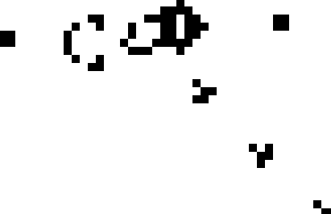

# gameoflife.rs

Simple game of life implementation in Rust, my first Experiment in Rust.
- Uses Piston for graphics
- Read life 1.06 files 
- World represented by quad tree

Improvements includes usage of screen in a more efficient and correct way.

Usage:
```
cargo run PATHTOFILE
```
Example:
```
cargo run resources/gosperglidergun_106.lif
```


